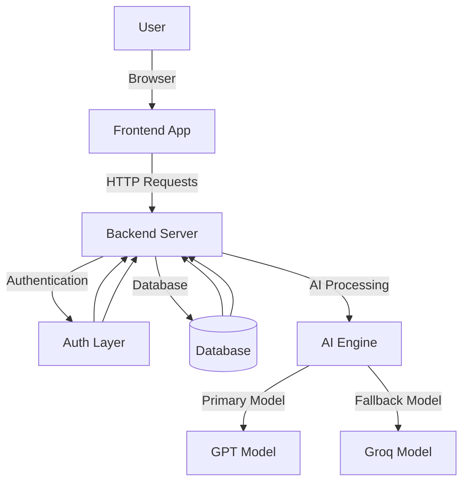

### 📑 Table of Contents

- 🧠 Overview
- 🎓 What Makes SmartQuizzer Different?
- 🏛️ Core Philosophy
- ✨ Key Features
- 🚀 Core Capabilities
- 👥 Target Audience
- 💻 Technology Stack
- 🏗️ System Architecture
- 🧭 User Journey & Experience Map
- 🖥️ Screen-by-Screen Breakdown
- 🏗️ Component Architecture
- 📊 Result Screen Breakdown
- 💻 Developer Setup Guide
- 🔮 Future Roadmap
- 🤝 Contributing
- 👥 Author
- 📜 License

## Overview

SmartQuizzer is an AI-driven intelligent quiz generation platform that transforms static learning content into dynamic, interactive quizzes. It enables users to generate quizzes instantly from topics or documents using LLMs like Groq/OpenAI.

---

## 🎓 What Makes SmartQuizzer Different?

| Feature | Traditional Quiz Apps | 🚀 SmartQuizzer |
|--------|----------------------|----------------|
| Content | Predefined questions | AI-generated in real-time |
| Input | Fixed syllabus | Topic / PDF-based |
| Question Types | Mostly MCQs | MCQ + Fill + Mixed |
| Experience | Static | Interactive + Adaptive |
| Analytics | Basic scores | Performance insights |

---

## 🏛️ Core Philosophy
**Learn → Test → Improve**

- 🧠 Contextual Understanding  
- ⚡ Real-Time Intelligence  
- 🎯 Active Recall  

---

## ✨ Key Features

| Feature | Description |
|--------|------------|
| 📄 Topic-to-Quiz | Generate quizzes instantly |
| ⚡ AI Integration | Uses Groq/OpenAI |
| 🧠 Mixed Questions | MCQ + Fill |
| 📊 Analytics | Performance charts |
| 🏆 Leaderboard | Ranking system |
| 🎨 UI | Streamlit-based |

---

## 🚀 Core Capabilities

| Capability | Implementation | Impact |
|-----------|---------------|--------|
| AI Generation | Groq API | Dynamic quizzes |
| JSON Output | Structured responses | Clean UI |
| Session State | Streamlit | Smooth UX |
| Visualization | Matplotlib | Insights |

---

## 👥 Target Audience

| User | Use Case | Benefit |
|------|--------|--------|
| Students | Exam prep | Quick revision |
| Teachers | Quiz creation | Saves time |
| Developers | AI projects | Practice |

---

## 💻 Technology Stack

| Layer | Tech |
|------|-----|
| Frontend | Streamlit |
| Backend | Python |
| AI | Groq/OpenAI |
| Data | JSON |
| Charts | Matplotlib |

---

## 🏗️ System Architecture



---


## 🧭 User Journey & Experience Map

SmartQuizzer is designed to transform static learning material into an interactive and intelligent quiz experience.

| Stage | User Goal | System Touchpoint | Emotional State |
|------|----------|------------------|----------------|
| 1. Upload | Provide study material | PDF/Text Upload Interface | 📤 Curious |
| 2. Setup | Configure quiz | Quiz Settings Panel | ⚙️ In Control |
| 3. Processing | Wait for AI generation | Loading / Processing Screen | ⏳ Anticipating |
| 4. Attempt | Answer generated questions | Quiz Interface | 🧠 Focused |
| 5. Results | Evaluate performance | Score & Leaderboard | 🎯 Motivated |

---

## 🖥️ Screen-by-Screen Breakdown

The UI is built using a clean and minimal design approach with responsive layouts.

| Screen Name | Core Functionality | Key UI Elements |
|------------|------------------|----------------|
| 🏠 Dashboard | Central overview | Score Summary, Leaderboard, Recent Activity |
| 📄 Upload Page | Input study material | File Upload, Text Input, Submit Button |
| ❓ Quiz Page | Interactive quiz | Questions, Options, Timer |
| 📊 Result Page | Performance analysis | Score Display, Answer Review |
| 🏆 Leaderboard | Rank users | Score Rankings, User Stats |

---

## 🏗️ Component Architecture

| Component | UI Role | Functionality |
|----------|--------|--------------|
| Sidebar | Navigation | Quick access to Dashboard, Quiz, Leaderboard |
| Main Content | Display Area | Dynamic rendering of pages |
| State Manager | Data Handling | Maintains quiz state & results |
| API Layer | Backend Communication | Handles AI and database requests |

---

## 📊 Result Screen Breakdown

The result page provides meaningful insights into user performance.

| Component | Implementation | Purpose |
|----------|--------------|--------|
| 🎯 Score | Dynamic Calculation | Shows final quiz score |
| 📈 Performance | Data Visualization | Displays accuracy |
| 📝 Answer Review | Highlight System | Shows correct & incorrect answers |
| 🏆 Leaderboard Update | Database Sync | Updates ranking |

---

## 💻 Developer Setup Guide

### 📋 Prerequisites

- Python 3.9+
- Streamlit
- API Key (Groq / OpenAI if used)
---

## 🔮 Future Roadmap

We aim to continuously enhance SmartQuizzer with advanced features and better user experience.

- 🤖 Integration with more AI models for improved question generation  
- 📊 Advanced analytics and performance insights  
- 🌐 Full cloud deployment with scalability  
- 👤 User authentication and personalized dashboards  
- 🎮 Gamification features like streaks and achievements  
- 📱 Mobile-friendly responsive design  

---

## 🤝 Contributing

Contributions are welcome and appreciated!

1. Fork the repository  
2. Create your feature branch  
   ```bash
   git checkout -b yourname
  ---

## 👥 Author

**Akshitha Manne**  
- 💻 Full Stack Developer  
- 🌐 Skilled in MERN Stack, Python, and AI-based applications  
- 🚀 Passionate about building smart learning systems  

---

## 📜 License

This project is licensed under the **MIT License**.

You are free to:
- ✔ Use the project for personal and commercial purposes  
- ✔ Modify and distribute the code  
- ✔ Improve and build upon this project  

**Note:** Proper credit must be given to the original author.

---

